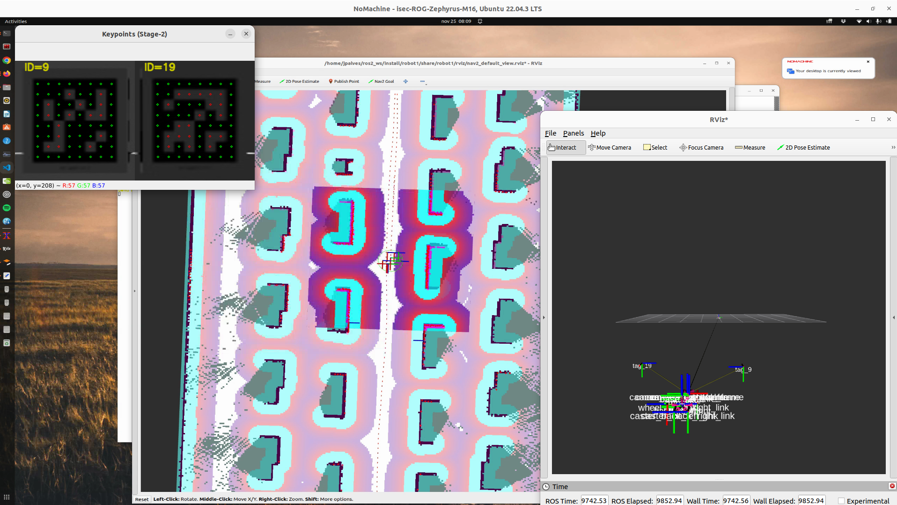

# deeptag_ros
João Pedro Alves 2023 - This is a wrapper for deeptag-pytorch (https://github.com/herohuyongtao/deeptag-pytorch) for ROS2

## How to run
install ros2 humble the configuration file is in the config folder, change the topics of camera for you camera. it's configured for Apriltags h11.

cd ros2_ws/src

git clone https://github.com/jpalves/deeptag_ros.git

cd ..

colcon build


run with this command:

ros2 launch deeptag_ros deeptag.launch.py 

## Dependencies
OpenCV 4

Pytorch 1.13

Python 3.10

## Terms of use
The source code is provided for research purposes only. Any commercial use is prohibited. When using the code in your research work, please cite the following paper:
> **"DeepTag: A General Framework for Fiducial Marker Design and Detection."**  
> Zhuming Zhang, Yongtao Hu, Guoxing Yu, and Jingwen Dai  
> *IEEE TPAMI 2023*.
```
@article{zhang2023deeptag,
  title={{DeepTag: A General Framework for Fiducial Marker Design and Detection}},
  author={Zhang, Zhuming and Hu, Yongtao and Yu, Guoxing and Dai, Jingwen},
  journal={IEEE Transactions on Pattern Analysis and Machine Intelligence},
  volume={45},
  number={3},
  pages={2931-2944},
  year={2023},
  publisher={IEEE}
}
``` 
